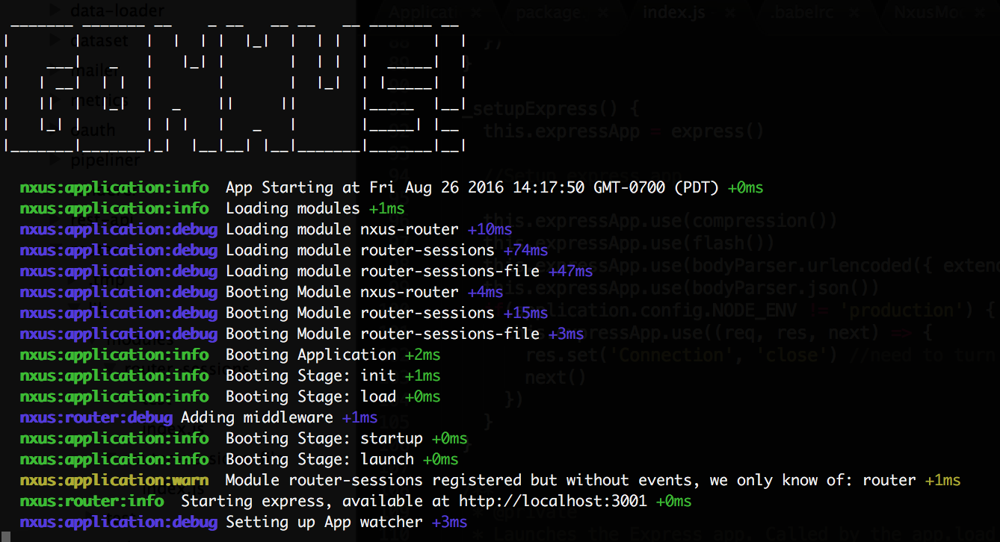

# Installing Modules

Our app is pretty basic - it will start and load, but it doesn't do much else. So let's add some modules.  Nxus modules are collections are full featured functional components designed to give you data management, routes, UX and anything else you need for your app. Nxus offers pre-configured meta-packages that make installing lots of modules easy, but we're going to add the core packages individually so you can see what each does.

## Router
First, our web app will need web routes, so we will install the `nxus-router` module.

```
> npm install nxus-router --save
```
Then run 
```
> npm start
```
Now you'll see the console outputs some new messages



Finally, navigate to `http://localhost:3001` in your web browser an you'll see a 404 page.
