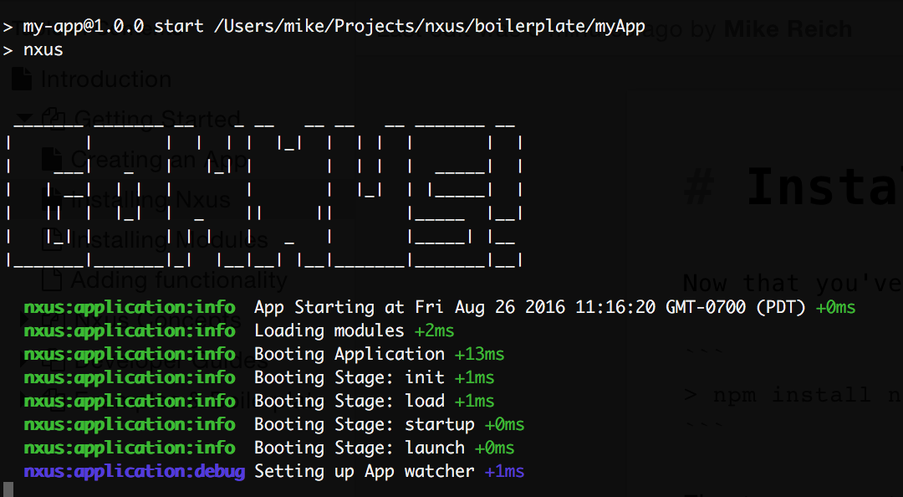

# Installing Nxus

Now that you've created an initialized your application, we'll want to install the Nxus core.

```
> npm install nxus-core --save
```

The `nxus-core` module contains all the files you need to run a Nxus application. But by design, the core package doesn't do much else by itself. In order to start Nxus, you'll need to specify a startup script.  Edit your `package.json` file and add the following line to the `scripts` section:

```
"start": "nxus"
```

Now in the terminal, type `npm start`. You should see the Nxus app starting up and printing some information to the console.

